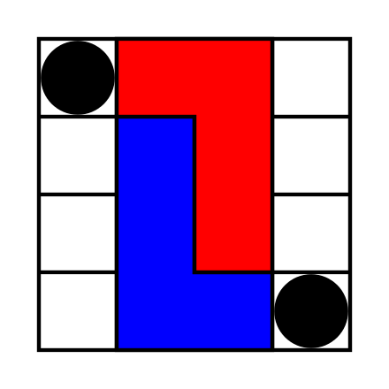

# flgame

A L game for flutter android after Edward Bono, see wikipedia, L game. And help button of the game.

        
    

## L game (Wikipedia)

The L game is a simple abstract strategy board game invented by Edward de Bono. It was introduced in his book The Five-Day Course in Thinking (1967).
The L game is a two-player game played on a board of 4×4 squares. Each player has a 3×2 L-shaped tetromino, and there are two 1×1 neutral pieces.
On each turn, a player must first move their L piece, and then may optionally move either one of the neutral pieces. The game is won by leaving the opponent unable to move their L piece to a new position.  Pieces may not overlap or co        One basic strategy is to use a neutral piece and one's own piece to block a 3×3 square in one corner, and use a neutral piece to prevent the opponent's L piece from swapping to a mirror-image position. Another basic strategy is to move an L piece to block a half of the board, and use the neutral pieces to prevent the opponent's possible alternate positions. ver other pieces, or let the pieces off the board. On moving the L piece, it is picked up and then placed in empty squares anywhere on the board. It may be rotated or even flipped over in doing so; the only rule is that it must end in a different position from the position it started—thus covering at least one square it did not previously cover. To move a neutral piece, a player simply picks it up then places it in an empty square anywhere on the board. 
        
These positions can often be achieved once a neutral piece is left in one of the eight killer spaces on the perimeter of the board. The killer spaces are the spaces on the perimeter, but not in a corner. On the next move, one either makes the previously placed killer a part of one's square, or uses it to block a perimeter position, and makes a square or half-board block with one's own L and a moved neutral piece.

